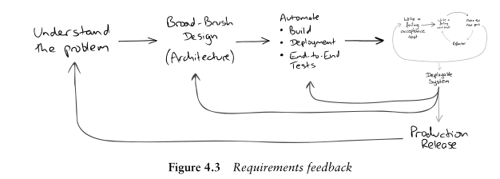
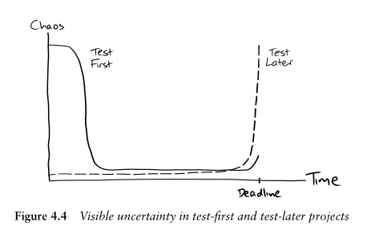

# Chapter 4. Kick-Starting the Test-Driven Cycle

## Introduction

- How to build the first test when building the first feature? How to test when the is not system yet?
- Attent to build, deploy and test

## First, test a walking skeleton
- It's hard to build test and feature at the same time
- Build a walking-skeleton first, then the acceptance test
- __Walking skeleton__: Implementation thinnest functionality that we can build, deploy and test end-to-end
    - Inclues major component, comunication mechanism, to start working in first feature
    - Structure, no cleaning up the test
    - First feature test is the moment to write test you want to read. Reflects behavior of the system

- Why is important to include deploy the system and run the test:
    - Error prone activity. Dummy server is not a production-like environment
    - Moment where developers join the rest of the organization and learns how operates

- __End to end__: Process and system. System and test from scratch until build and deployable structure
    - Unknown risk always involved until test runs end-to-end

## Deciding shape of the walking skeleton
- High level structure of the app, undestand before build, deploy and test cycle
- Whiteboard drawing
- Landscape of the solution first, before any code
- Client requirements, functional and not functional
- __First test__: 

- Don't confuse previous diagram with "big Design Up Front" (BDUF), is not the hole design,and it's likely to be wrong. Details are for later when the system grows based in real feedback with th TDD cycle

## Build source of feedback
Validate decisions by building feedback.
- Ideal situation: Deploy regulary to a real production system, with feedback from stackholders an theirs needs
- Feedback for developers: Feedback from automatizing building and testing

- Advantages to deploy: 
    - Release frequent to real users
    - Make changes in response to feedback
    - Customer priorities check with real product or not

## Expose uncertaintly early
- First steps are slow because:
    - Stablish a lot of infraestructure
    - Asking and answering many awkard questions
    - Learning more about requirements
    - Learning about target environemnt

- Projects with late integration:
    - Turn difficult towards the end with limited time and budget, start calmly

- Incremental development:
    - Start stressful, learning how to work together, after few features it calms down, deployments and upgrades has been automatized and now is a calm routine

## TDD when system is already in production
For systems already in production, that need to be extended, adapted or replaced, is not usuful to do a "walking skeleton".

- Work with the structure given, even if it is unorganized
- When no test, start with automate build and deploy process, then add end-to-end test in areas to change
    - Now refactor and introduce unit test when adding functionalites